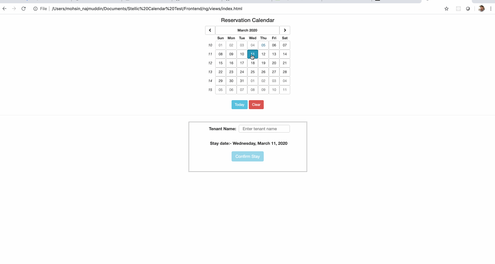

# Calendar-Test

1. Run api server for accessing the backend apis.
2. Run index.html file directly on the browser, the application will start working. (remember, enter the correct path of index.html file on the browser, so that the file can open)

# Gif

